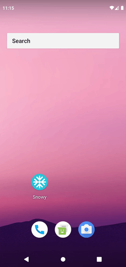
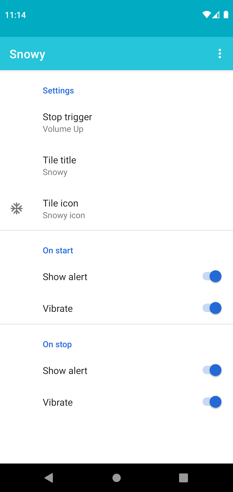
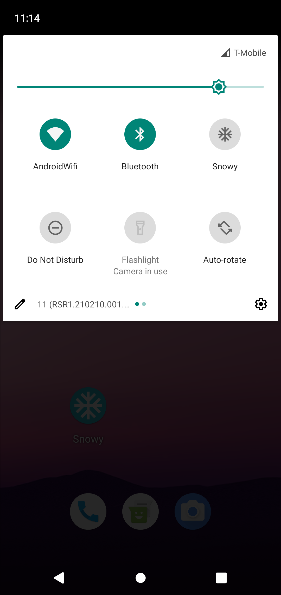

# Snowy - Touch Blocker [Root]</img>
 

*A quick settings tile to block touch screen for real. Requires root.*

| Demo | Settings | Tile |
|---|---|---|
|  |  |  |

# Download

# License

Snowy is licenced under [`GNUv3.0`](LICENCE) also uses [`blockevent`](https://github.com/nmelihsensoy/blockevent) library which is licenced under `Apache 2.0` and can build from source.

    Snowy Copyright 2022  N.Melih Sensoy

    This program is free software: you can redistribute it and/or modify
    it under the terms of the GNU General Public License as published by
    the Free Software Foundation, either version 3 of the License, or
    (at your option) any later version.

    This program is distributed in the hope that it will be useful,
    but WITHOUT ANY WARRANTY; without even the implied warranty of
    MERCHANTABILITY or FITNESS FOR A PARTICULAR PURPOSE.  See the
    GNU General Public License for more details.

    You should have received a copy of the GNU General Public License
    along with this program.  If not, see <https://www.gnu.org/licenses/>.